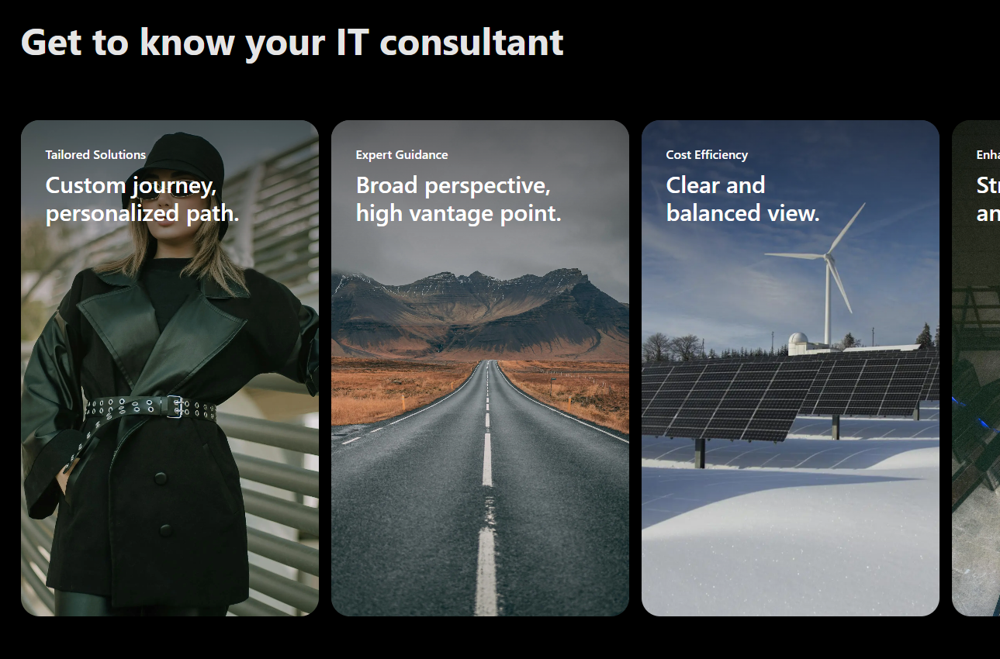
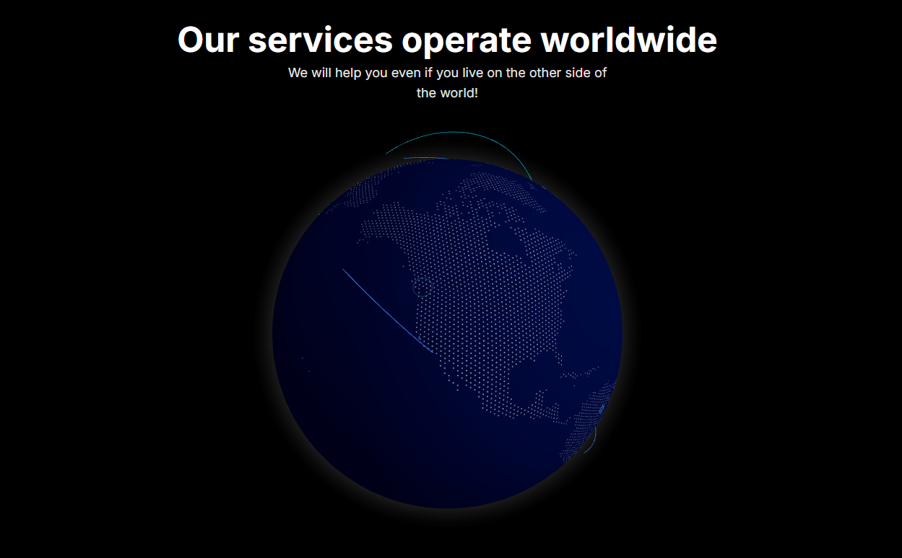

# 💻 IT Consultant

IT Consultant is a sleek, frontend-focused web project built with Next.js, Tailwind CSS, and React. It showcases cutting-edge design elements, including a 3D GitHub Globe, a smooth Apple-style carousel, and immersive scrolling animations where images transition from the header background to the main content as you scroll.

## 💜 Features

- 3D GitHub Globe – Interactive globe visualization that enhances the user experience.
- Apple-Style Carousel – A refined, elegant carousel inspired by Apple's design principles.
- Immersive Scroll Animations – Images initially part of the header background gradually descend into the main content as you scroll.
- Modern UI/UX – Smooth transitions and elegant animations for a premium look and feel.
- Built with Next.js & Tailwind CSS – Ensuring high performance and scalability.
- Fully Responsive Design – Optimized for all devices, from mobile to desktop.

## 📸 Zrzuty Ekranu

    
    

## ℹ FAQ

### What is IT Consultant?

IT Consultant is a frontend-focused web project designed to demonstrate advanced UI/UX concepts, including 3D elements, smooth carousels, and interactive scroll animations.

### How does the scrolling animation work?

As you scroll, images that start in the header background gradually move downward and become the main visual focus on the screen.

### Is the GitHub Globe interactive?

Yes! The 3D GitHub Globe allows users to interact with it, making the experience more engaging.

### Can I customize the carousel?

Yes, the Apple-style carousel can be adjusted to fit different content and design needs.

### Is IT Consultant mobile-friendly?

Absolutely! The entire project is designed to be fully responsive and optimized for various screen sizes.
